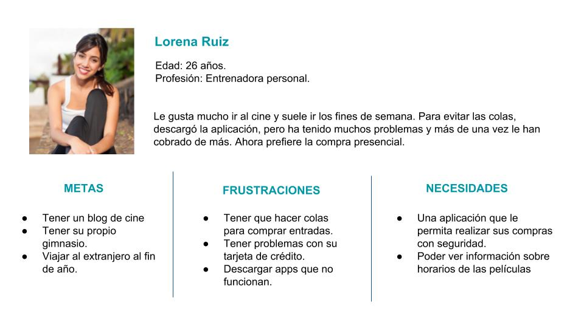
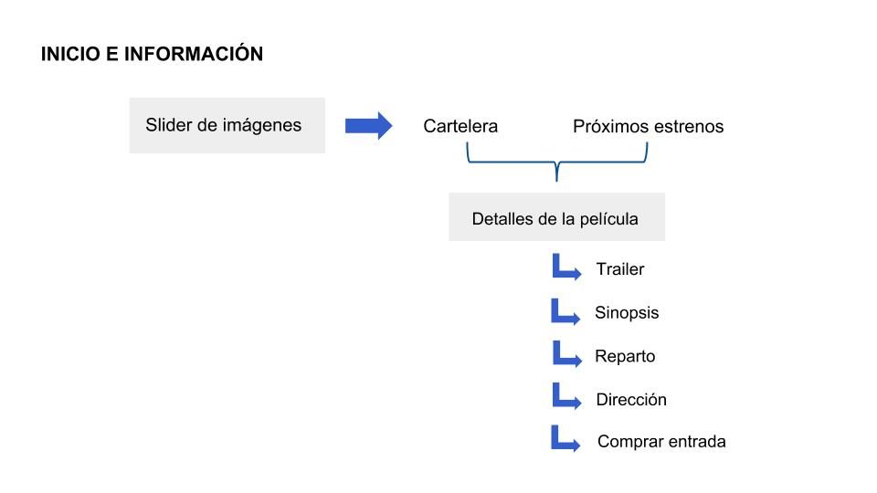
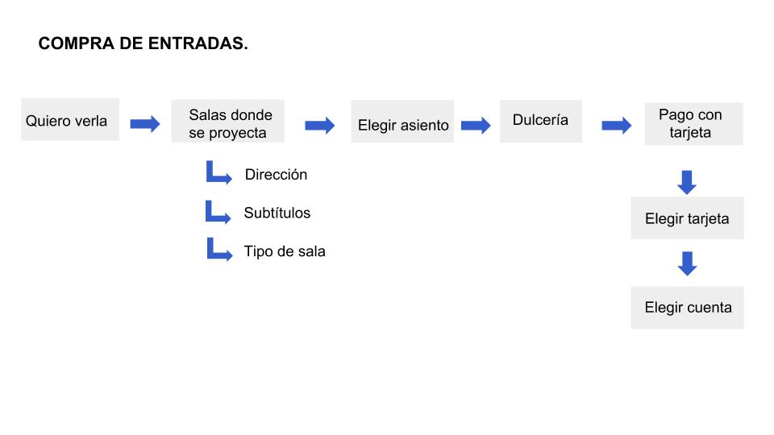

# CINEPLANET APP - REDISEÑO

## **Descripción del proyecto**

El siguiente proyecto consiste en el re diseño de la aplicación de Cineplanet Perú, con el fin de mejorar la accesibilidad, funcionalidad y experiencia de usuario; enfocado en el proceso de compra de entradas.

## **Objetivo del proyecto**

Mejorar el proceso de compra de entradas al cine y aumentar el número de usuarios activos. 

## **Research**
Cineplanet Perú es una app con más de 4 mil descargas. Su última actualización fue el 21 de febrero del 2018 y encuentra ahora en la versión 3.4.1. Las principales funcionalidades son interacciones de los usuarios y compra de entradas.

### Comentarios y clasificación de los usuarios.

En la página Play Store se encontraron las siguientes opiniones y problemas de los usuarios:

- Error en los procesos de compra.
- Cobros indebidos.
- Lentitud de la aplicación.
- No es fácil de usar.
- Confusión.

> Malisima, se cuelga, no permite abrir tu cuenta, tienes que activarla por segunda vez, los pagos son retenidos, tengo un buen dinero renetido por su culpa, me gano descontento y desconfianza en la aplicación y en su misma empresa.
Eduardo Enrique Mejía Morales

> La app anterior era buena, esta act es realmente pésima. Horrible interfaz, difícil de comprar, errores inesperados y no puedo ingresar a mi cuenta, las personas de "soporte" no responden y al final nada puedes hacer.
Ramón Gregorio.

>  En esta no es tan fácil comprar. Se necesitan demasiadas ventanas para adquirir la entrada y ni siquiera aparece el género de la película. 
Lenny arias camacho  

### Análisis de la aplicación actual

Para decidir que funcionalidades se debían mejorar, se realizó un análisis de la estructura de contenidos de la aplicación actual. Y así identificar los procesos que se repiten y la cantidad de pasos que se deben completar para realizar las tareas. 

#### Arquitectura de contenido de la aplicación actual.

#### **Problemas principales**

## **Identificación del problema**

### Problemnt Statements

- Problemás con el inicio de sesión
- Proceso largo de compra.
- Información confusa.
- Error en el sistema de pago.

### HMW

- ¿Cómo podríamos acelerar el proceso de compra?
- ¿Cómo podríamos ofrecer los productos de confetería al mismo tiempo que las entradas?
- ¿Cómo podríamos organizar mejor los contenidos de la aplicación?

## **Propuesta de diseño**

Como propuesta de solución se decidió centrar el proyecto en mejorar el flujo de compra de entradas, desde que se brinda información sobre las películas, hasta el pago virtual. 

### User persona

### Propuesta de arquitectura de la información

#### *Inicio:* 

#### *Compra de entradas:*

### Feature list

### Prototipo en alta fidelidad

[Cineplanet Perú](https://marvelapp.com/ca48gf4/screen/40306422)

#### Resultados del testing del prototipo

Se realizó el testing con tres personas, para probar el flujo desde el inicio de la aplicación, hasta la muestra de información de las películas.  
Se obtuvo el siguiente feedback:

- Confusión con los íconos de "películas" y "salas de cine"
- Necesidad de una opción para esquivar los sliders del inicio.
- El uso de colores era agradable.

#### Iteración

Luego del feedback recibido, se procedió a reordenar la información. Se eliminó el ícono de salas y se movió esa información como contenido del menú hamburguesa. Se implementó la visualización de los trailers.
Se completó el flujo de compra de entradas y combos de la dulcería.

#### Resultados del segundo testing

Con el flujo completo se obtuvieron los siguientes comentarios.

- Algunos textos y contenidos estaban muy juntos.
- Dificultad de visualización en algunas vistas.
- El flujo de compra era mucho más rápido que con la aplicación original. 

## Herramientas utilizadas:

- Figma
- Marvel